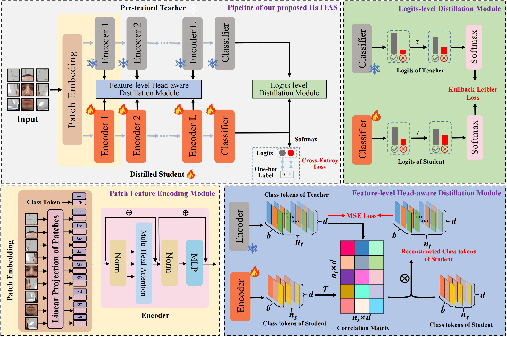
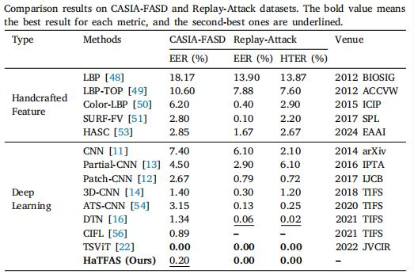
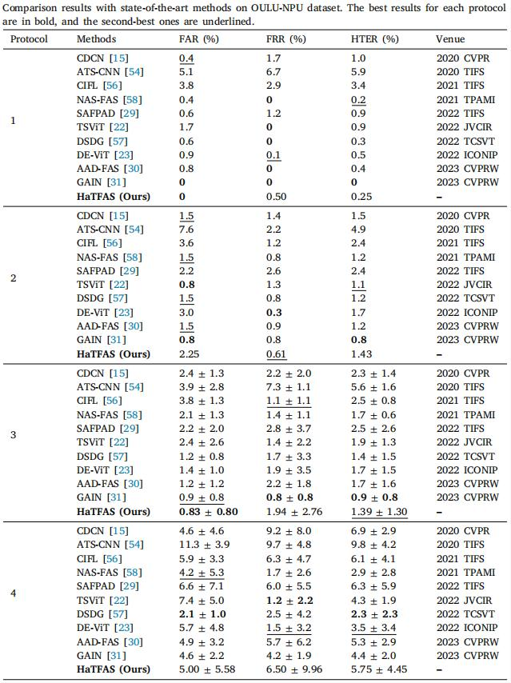
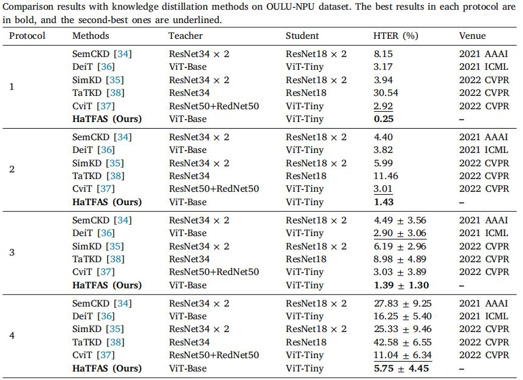

# HaTFAS

Official repository for the article "Efficient Face Anti-Spoofing via Head-aware Transformer based Knowledge Distillation with 5 MB model parameters", which has been accepted at Applied Soft Computing and can be found [here](https://doi.org/10.1016/j.asoc.2024.112237).

---

## 🔔Introduction

Inspired by the powerful global modelling ability of self-attention and the model compression ability of knowledge distillation, a simple yet effective knowledge distillation approach is proposed for Face Anti-Spoofing(FAS) under transformer framework. Our primary idea is to leverage the rich knowledge of a teacher network pre-trained on large-scale face data to guide the learning of a lightweight student network. The main contributions of our method are threefold: 
(1) Feature- and logits-level distillation are combined to transfer the rich knowledge of teacher to student. 
(2) A head-aware strategy is proposed to deal with the dimension mismatching issue of middle encoder layers between teacher and student networks, in which a novel attention head correlation matrix is introduced.
(3) Our method can bridge the performance gap between teacher and student, and the resulting student network is extremely lightweight with only 5 MB parameters.

<div align="center">
    
</div>

## 🔨 Installation

- Install `CUDA 12.0` with `cuDNN 8` following the official installation guide of [CUDA](https://docs.nvidia.com/cuda/cuda-installation-guide-linux/index.html) and [cuDNN](https://developer.nvidia.com/rdp/cudnn-archive).

- Setup conda environment:
```bash
# Create environment
conda create -n HaTFAS python=3.8.20
conda activate HaTFAS

# Install requirements
pip install torch torchvision torchaudio --extra-index-url https://download.pytorch.org/whl/cu118

# Clone HaTFAS
git clone https://github.com/Maricle-zhangjun/HaTFAS.git
cd HaTFAS

# Install other requirements
pip install -r requirements.txt
```

## 🚀 Getting started

**Data preparation**

Since the datasets used in our research are face videos, each video is first split into frames. Then, face region of each video frame is detected via [MTCNN](https://github.com/ipazc/mtcnn) and resized the size of 224×224×3. The folder of pro-processed dataset as:

```
dataset_path/train(val or test)/true/video_dir/face_image_1.jpg
dataset_path/train(val or test)/attack/video_dir/face_image_1.jpg
```

**Pretraining teacher networks**

For each face dataset, teacher network is pre-trained based on [DeiT](https://github.com/facebookresearch/deit) and then used to supervise the learning of student, the backbone differences between teacher and student as: 

|          Model          | Embedding dimension | Heads | Layers |
|:-----------------------:|:---------:|:---------:|:---------:|
|Teacher (ViT-Base)|     768     |   12    |  12  |
|Student (ViT-Tiny)|     192     |    3    |  12  |

**Distilling student networks**

To distill student based on ViT-Tiny with `HaTFAS`, run:

```bash
python main.py --batch-size 128 --epochs 300 --distributed --output_dir <model_save_path>\
    --data-path <face_dataset_path> --data-set FACE --teacher-path <pretrained_teacher_path>\
    --model deit_tiny_patch16_224 --teacher-model deit_base_patch16_224 --distillation-type soft\
    --distillation-alpha 0.7 --distillation-beta 1 --distillation-tau 3 --s-id 4 6 8 --t-id 4 6 8
```

**Evaluating student networks**

To eval the distilled student with `HaTFAS`, run:

```bash
python main.py --batch-size 128 --eval --data-path <face_dataset_path> --data-set FACE_TEST\
    --model deit_tiny_patch16_224 --resume <distilled_student_path>
```

## Main results

**Comparison results on CASIA-FASD and Replay-Attack datasets**

<div align="center">
    
</div>

**Comparison results with state-of-the-art methods on OULU-NPU dataset**

<div align="center">
    
</div>

**Comparison results with knowledge distillation methods on OULU-NPU dataset.**

<div align="center">
    
</div>

## ✏️ Citation
If you find this work useful for your research, please feel free to leave a star⭐️ and cite our paper:

```bibtex
@article{ZHANG2024112237,
title = {Efficient face anti-spoofing via head-aware transformer based knowledge distillation with 5 MB model parameters},
journal = {Applied Soft Computing},
volume = {166},
pages = {112237},
year = {2024},
issn = {1568-4946},
doi = {https://doi.org/10.1016/j.asoc.2024.112237},
author = {Jun Zhang and Yunfei Zhang and Feixue Shao and Xuetao Ma and Shu Feng and Yongfei Wu and Daoxiang Zhou}
}
```